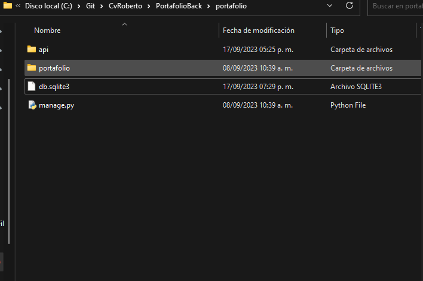
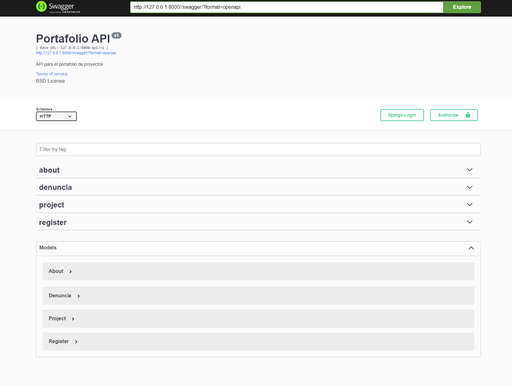

# Portafolio  Back

## Build Setup

## download sqlLite DB
Open the folder where the project is located and add the database that already contains data here


```bash
# install dependencies
$ pipenv shell 

# install all pipenv environment 
$ pipenv install 

# install swagger 
$ pipenv install drf-yasg

# server with http://127.0.0.1:8000/ default 
$ pipenv run dev 
# or 
$ python manage.py runserver
```

## Open Video portafolio  https://www.dropbox.com/scl/fo/a76bxosy8l58g26vq0vtc/h?rlkey=zcbde0eppezit1iy517yjwo6m&dl=0


## Open swagger http://127.0.0.1:8000/swagger/


